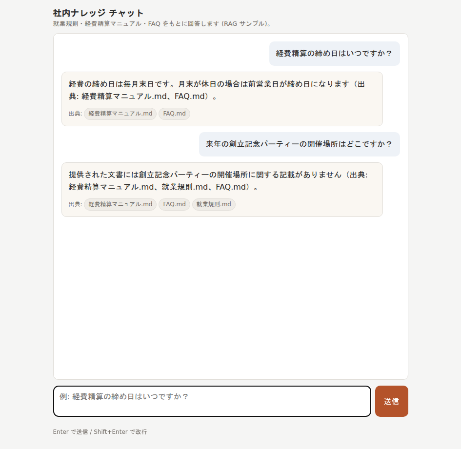

# ai-rag-template

業務システムに AI(RAG)を組み込むための最小テンプレート。
Azure OpenAI を裏に置いた `Microsoft.Extensions.AI`(`IChatClient` / `IEmbeddingGenerator`)で、
社内文書(就業規則・経費精算マニュアル・FAQ)に基づくチャット回答を返します。

新しい案件ごとにこのリポジトリを複製し、`data/` の文書とプロンプトを差し替えるだけで動かせることを狙った構成です。

## デモ



社内文書に**根拠がある質問**には出典(参照したファイル名)付きで回答し、**根拠が無い質問**には推測せず「記載がありません」と正直に答えます(ハルシネーション抑制)。

## 技術構成

| 項目 | 採用 |
|------|------|
| 言語 / FW | C# / ASP.NET Core (Minimal API) |
| LLM 抽象化 | Microsoft.Extensions.AI (`IChatClient` / `IEmbeddingGenerator`) |
| チャットモデル | Azure OpenAI にデプロイした `gpt-5-mini` |
| Embedding | Azure OpenAI にデプロイした `text-embedding-3-small` |
| ベクトルストア | SQLite で永続化(純マネージド・ネイティブ拡張なし) |
| 文書 | 架空企業の就業規則・経費精算マニュアル・FAQ(`data/`) |
| UI | 単一 HTML チャット画面(`wwwroot/`) |

## 設計上の工夫(見どころ)

業務システムへ AI を組み込む際に重要になる「信頼性」「保守性」「安全性」を意識した構成です。

- **出典付き回答でハルシネーションを抑制(主役)**: システムプロンプトで「渡した社内文書だけを根拠に答える/無ければ推測しない」を強制し、参照したファイル名を出典として返す。業務では「それらしい嘘」が最大のリスクなので、根拠の提示と「分かりません」と言える正直さを最優先にしている。
- **AI/ストアを差し替え可能な抽象設計**: LLM は `Microsoft.Extensions.AI` の `IChatClient` / `IEmbeddingGenerator`、ベクトル保管は自前の `IVectorStore` で抽象化。モデルやベクトル DB を変えても `Program.cs` の登録 1 行差し替えで済み、`RagService`(業務ロジック)は無変更。
- **RAG ロジックを 1 クラスに集約**: 質問の埋め込み→近傍検索→文脈付き生成を `RagService` に閉じ込め、UI(静的 HTML + fetch)と分離。既存の業務システムからは `RagService` を DI で呼ぶだけで再利用できる。
- **Secure by Default**: シークレットはコードに置かず user-secrets / 環境変数から注入し、未設定でも分かりやすく失敗。SQL はパラメータ化クエリのみ、モデル出力・外部データはフロントで `textContent` 描画して XSS を防止。
- **決定的ロジックはユニットテスト**: コサイン類似度・ベクトル直列化・チャンク分割など外部 API に依存しない箇所を xUnit で検証(外部 LLM/Embedding は実 API を叩かない)。

## 前提

- .NET 9 SDK(`dotnet --version` で確認。未導入なら https://dotnet.microsoft.com/download から)
- Azure OpenAI リソースと、以下 2 つのデプロイ
  - チャット: `gpt-5-mini`
  - 埋め込み: `text-embedding-3-small`

## セットアップ

### 1. Azure OpenAI の接続情報を設定

シークレットはコミットせず、ユーザーシークレットか環境変数で渡します。

ユーザーシークレットを使う場合(推奨):

```bash
cd src/AiRagTemplate
dotnet user-secrets init
dotnet user-secrets set "AzureOpenAI:Endpoint" "https://<your-resource-name>.openai.azure.com/"
dotnet user-secrets set "AzureOpenAI:ApiKey" "<your-azure-openai-api-key>"
dotnet user-secrets set "AzureOpenAI:ChatDeployment" "gpt-5-mini"
dotnet user-secrets set "AzureOpenAI:EmbeddingDeployment" "text-embedding-3-small"
```

環境変数で渡す場合(`:` を `__` に置換):

```bash
export AzureOpenAI__Endpoint="https://<your-resource-name>.openai.azure.com/"
export AzureOpenAI__ApiKey="<your-azure-openai-api-key>"
export AzureOpenAI__ChatDeployment="gpt-5-mini"
export AzureOpenAI__EmbeddingDeployment="text-embedding-3-small"
```

未設定でもアプリは起動し、チャット送信時に「Azure OpenAI が未設定です」と案内します。

### 2. 実行

```bash
dotnet run --project src/AiRagTemplate
```

初回起動時に `data/` の文書を読み込み、埋め込みを生成して SQLite(`App_Data/vectors.db`)へ格納します。
2 回目以降はストアにデータがあれば取り込みをスキップします。

ブラウザで `http://localhost:5179` を開き、例えば次のように質問します。

- 「経費精算の締め日はいつですか？」
- 「在宅勤務は週何日まで取れますか？」
- 「有給休暇はいつから使えますか？」

## 仕組み(リクエストの流れ)

```
質問
  → IEmbeddingGenerator で質問を埋め込み
  → IVectorStore.SearchAsync でコサイン類似度の高い上位 K チャンクを取得
  → System プロンプト + 取得チャンク + 質問 を組み立て
  → IChatClient.GetResponseAsync で回答生成
  → 回答 + 出典名 を JSON で返す
```

中核は `RagService`(`src/AiRagTemplate/Rag/RagService.cs`)です。業務システムへ組み込む際は、
この 1 クラスを DI から呼び出すだけで RAG 回答が得られます。

## API

| メソッド | パス | 説明 |
|----------|------|------|
| POST | `/api/chat` | `{ "message": "..." }` を受け、回答と出典を返す |
| POST | `/api/ingest?reset=true` | `data/` を再取り込み(`reset=false` で追記) |

レスポンスは共通エンベロープ `{ success, data, error }` で返します。

## テスト

```bash
dotnet test
```

決定的なロジック(コサイン類似度・ベクトル直列化・チャンク分割)をユニットテストしています。
LLM/Embedding は外部 API のため、ここでは実 API を叩かない範囲に限定しています。

## プロジェクト構成

```
ai-rag-template/
├── AiRagTemplate.sln
├── src/AiRagTemplate/
│   ├── Program.cs                 # ホスト構成・DI 配線・起動時取り込み
│   ├── Configuration/             # AzureOpenAIOptions(接続設定)
│   ├── Ai/                        # IChatClient/IEmbeddingGenerator 登録・未設定スタブ
│   ├── Rag/                       # RagService・IVectorStore・SqliteVectorStore・チャンカー等
│   ├── Endpoints/                 # Minimal API(/api/chat, /api/ingest)
│   ├── Models/                    # API モデル・共通レスポンスエンベロープ
│   ├── data/                      # 架空企業のサンプル文書(差し替え対象)
│   └── wwwroot/                   # 単一チャット画面(index.html, app.js)
└── tests/AiRagTemplate.Tests/     # ユニットテスト
```

## カスタマイズ(テンプレとしての使い方)

- 文書を差し替える: `src/AiRagTemplate/data/` の `.md` / `.txt` を入れ替え、`POST /api/ingest?reset=true` で取り込み直す。
- プロンプトを変える: `RagService` の `SystemPrompt` と取得件数 `TopK` を調整。
- ベクトルストアを差し替える: `IVectorStore` を実装し、`Program.cs` の
  `AddSingleton<IVectorStore, SqliteVectorStore>()` を 1 行差し替える(インメモリ・外部ベクトル DB 等)。
- モデルを変える: デプロイ名(`ChatDeployment` / `EmbeddingDeployment`)を設定で変更。

## 補足

- パッケージはフローティング指定(`9.*` 等)で最新を取得します。再現性を固定したい場合は具体的なバージョンへ。
- `Microsoft.Extensions.AI.OpenAI` の橋渡し拡張は本テンプレートでは `AsIChatClient()` /
  `AsIEmbeddingGenerator()` を使用しています。古いプレリリースでは `AsChatClient()` /
  `AsEmbeddingGenerator()` という名称のことがあるため、復元後にメソッド名が合わない場合は読み替えてください。
- SQLite ベクトルストアは検索時に全チャンクを読み出して C# 側で類似度計算する素朴な実装です。
  数百〜数千チャンク規模の PoC には十分ですが、大規模化する場合は専用ベクトル DB へ差し替えてください。
- `data/` の文書はすべて架空企業のサンプルで、実在の規程ではありません。
